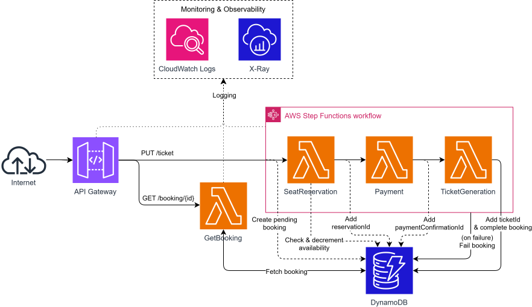

# DevOpsGroup20
DevOps and Cloud-based software. 2026. University of Amsterdam. Group 20.

#### Project Team
- Bjorgvin Atli Juliusson (bjorgvin.juliusson@student.uva.nl)
- Kacper Machaj (kacper.machaj@student.uva.nl)
- Hubert Mazur (hubert.mazur@student.uva.nl)
- Dimitris Thomopoulos (dimitris.thomopoulos@student.uva.nl)

# Project Requirements & Scope

## Overview

This project involves migrating a ticket booking system from **Camunda Cloud (orchestration-as-a-service)** to a **serverless AWS architecture** while preserving the core business logic and workflow orchestration patterns.

---

## In Scope

### 1. Core Logic (Must Preserve)

#### Three-Step Booking Workflow
The system must execute three sequential steps to complete a booking:

1. **Reserve Seats** - Check availability and reserve the requested seats
2. **Process Payment** - Handle payment processing with a 30-second timeout
3. **Generate Ticket** - Create the ticket document with retry logic

Each step must complete successfully before proceeding to the next.

#### Compensation Logic (Saga Pattern)
If any step fails, the system must gracefully fail and conclude the booking process.

- **Payment fails/times out** → Step Functions increments availableSeats back in the SeatCapacity table, then marks booking as FAILED."
- **Ticket generation fails** → Step Functions increments availableSeats back in the SeatCapacity table, then marks booking as FAILED."
- **Seat reservation fails** → No compensation needed (nothing to rollback)

This ensures no partial bookings exist in the system.

#### Timeout Enforcement
- Payment processing **must complete within 30 seconds**
- If timeout occurs, seats must be automatically released
- Other steps have no explicit timeout requirements

#### Retry Logic
- **Seat reservation** → Fail immediately, no retries
- **Payment processing** → No retries, enforce 30-second timeout
- **Ticket generation** → Multiple retry attempts with exponential backoff

#### Failure Simulation
The system must support simulated failures for testing:
- `simulateBookingFailure=seats` → Force seat reservation to fail
- `simulateBookingFailure=payment` → Force payment to fail/timeout
- `simulateBookingFailure=ticket` → Force ticket generation to fail

This allows testing of compensation logic without external dependencies.

---

### 2. API Requirements

#### Create Booking Endpoint
**Endpoint:** `PUT /ticket`

**Behavior:**
- Accept booking requests (with optional failure simulation parameter)
- Generate a unique `bookingReferenceId`
- Store initial booking record in database with status `PENDING`
- Start the workflow asynchronously
- Return `202 Accepted` immediately with the booking ID
- Do not block waiting for workflow completion

**Query Parameters:**
- `simulateBookingFailure` (string, optional) - Simulate failure at specific step: `"seats"`, `"payment"`, or `"ticket"`

**Response:**
`202 Accepted`
```json
{
  "bookingReferenceId": "uuid-string"
}
```
If seat reservation later fails (`simulateBookingFailure=seats` or no capacity), the booking ends as `FAILED` and can be observed via `GET /booking/{bookingReferenceId}`.

#### Get Booking Status Endpoint
**Endpoint:** `GET /booking/{bookingReferenceId}`

**Behavior:**
- Query the database for the booking record
- Return booking status and any completed step data

**Response:**
```json
{
  "bookingReferenceId": "uuid",
  "status": "PENDING" | "COMPLETED" | "FAILED",
  "reservationId": "string (if available)",
  "paymentConfirmationId": "string (if available)",
  "ticketId": "string (if available)"
}
```

---

### 3. Workflow Orchestration

The system must:
- **Orchestrate** the three-step workflow (Check Availability → Pay → Ticket)
- **Coordinate** compensation logic when failures occur
- **Track** workflow state and execution history
- **Enforce** timeouts and retry policies
- **Execute** steps in strict sequential order
- **Update** booking status in database as workflow progresses

In the current system, Camunda/Zeebe handles this orchestration. In the new system, **AWS Step Functions** will handle it.

---

### 4. Mock Services

Since this is a demonstration system, the three service implementations are **fake/mock services**:

#### Reserve Seats Service
- Reads `SEAT_CAPACITY_TABLE_NAME` from environment
- If `simulateBookingFailure=seats`, throws before any seat decrement
- Atomically decrements `availableSeats` with a conditional DynamoDB update (`availableSeats >= 1`)
- Throws `NoSeatsAvailable` when conditional update fails
- Generates fake `reservationId` on success
- Booking record is updated by the Step Functions `Add reservationId` state

#### Payment Service
- Simulate payment processing with 2-second delay
- Generate fake `paymentConfirmationId`
- Update booking record in database with `paymentConfirmationId`
- Optionally timeout or fail based on simulation parameter
- No actual payment gateway integration required

#### Ticket Generation Service
- Simulate ticket creation
- Generate fake `ticketId` or ticket URL
- Update booking record in database with `ticketId`
- Optionally fail to trigger retry logic
- No actual PDF generation or storage required

**Key Point:** We are **not building real services**. We are demonstrating workflow orchestration, fault tolerance, and compensation patterns using mock implementations.

---

### 5. Data Persistence

The system must maintain booking state and seat availability in a database:

#### Database Schema

**Bookings Table** stores:
- `bookingReferenceId` (primary key, UUID) - Generated on initial PUT request
- `status` (string) - Current workflow state: `PENDING`, `COMPLETED`, `FAILED`
- `reservationId` (string, nullable) - Set after successful seat reservation
- `paymentConfirmationId` (string, nullable) - Set after successful payment
- `ticketId` (string, nullable) - Set after successful ticket generation
- `createdAt` (timestamp) - When booking was created
- `updatedAt` (timestamp) - Last status update

**SeatCapacity Table** stores:
- `id` (primary key, string) - Fixed value "CAPACITY"
  - `totalSeats` (number) - Total seat capacity, configured at deployment
  - `availableSeats` (number) - Current available seats, updated atomically on each reservation

The table is seeded on deployment using GitHub Actions variables (`TOTAL_SEATS`, `AVAILABLE_SEATS`), with a conditional write that skips the seed if the row already exists.

#### Database Technology
- Use **Amazon DynamoDB** for serverless, scalable storage
- Single-table design for Bookings with `bookingReferenceId` as partition key
- Single-row table for SeatCapacity with atomic updates for concurrency safety
- No complex queries or relational logic required

#### Update Pattern
- Lambda functions update the database after each successful step
- Step Functions directly updates DynamoDB via SDK integrations 
- Database serves as source of truth for booking state
- Seat reservation performs atomic decrement on `SeatCapacity.availableSeats`
- Compensation (`Release Seats` state) performs atomic increment when payment/ticket steps fail
- Seat reservation failures go directly to `Fail booking` (no release needed because no seat was taken)

---

### 6. Observability & Monitoring

The system must provide:

#### Distributed Tracing
- Trace requests across all Lambda functions
- Visualize the complete workflow execution path
- Identify bottlenecks and failures
- Use **AWS X-Ray** for distributed tracing

#### Structured Logging
- Log all workflow events in JSON format
- Include context (bookingId, step name, timestamps)
- Use **CloudWatch Logs** for centralized logging

#### Metrics & Dashboards
- Track success rates, failure rates, latency
- Monitor timeout occurrences and retry attempts
- Create dashboards showing request rate, errors, and performance
- Use **CloudWatch Metrics & Dashboards**

#### Alerting
- Alert on error rate thresholds
- Alert on latency degradation
- Use **CloudWatch Alarms** with appropriate thresholds

---

### 7. Infrastructure as Code

All infrastructure must be defined and deployed using **CloudFormation**:

- API Gateway HTTP API
- Lambda functions (4 total: SeatReservation, Payment, TicketGeneration, GetBooking)
- Step Functions state machine
- DynamoDB tables (Bookings and SeatCapacity)
- SQS queue (for async payment processing)
- IAM roles and policies
- CloudWatch log groups, dashboards, and alarms
- X-Ray tracing configuration

The infrastructure should be:
- **Repeatable** - Can be deployed multiple times without manual intervention
- **Version controlled** - All infrastructure code in Git

---

### 8. CI/CD & Deployment

The project must include an automated CI/CD pipeline to ensure repeatable, reliable deployments.

#### Pipeline Stages
The pipeline will run on every push to the main branch and on pull requests:

1. **Lint & Static Analysis** - Check code style and quality
2. **Unit Tests** - Run automated tests for Lambda function logic
3. **Build** - Package Lambda functions for deployment
4. **Deploy (Staging)** - Deploy to a staging environment using CloudFormation
5. **Integration Tests** - Run end-to-end tests against the staging environment
6. **Deploy (Production)** - Deploy to production on successful merge to main

#### Tooling
- **GitHub Actions** for CI/CD pipeline automation
- **AWS CloudFormation** for infrastructure deployment (`aws cloudformation deploy`)
- **AWS SAM or raw CloudFormation** for packaging and deploying Lambda functions
- For future cloud deployment: use GitHub Actions OIDC integration with AWS IAM (no long-lived secrets stored in GitHub)

#### Implemented E2E Workflow Pipeline
- Workflow file: `.github/workflows/booking-workflow-e2e-localstack.yml`
- Coverage:
  - Happy path
  - `simulateBookingFailure=seats`
  - `simulateBookingFailure=payment`
  - `simulateBookingFailure=ticket`
  - Final seat capacity assertion (`availableSeats=99`)
- Test runner: `tests/e2e/booking-workflow.mjs`
- Trigger: `pull_request` and manual `workflow_dispatch`
- Runtime flow:
  1. Start LocalStack via `docker compose`
  2. Build with `samlocal build`
  3. Deploy into LocalStack with `samlocal deploy`
  4. Resolve API Gateway id from CloudFormation resources
  5. Resolve `SeatCapacity` table and seed `CAPACITY` row (`totalSeats=100`, `availableSeats=100`)
  6. Execute E2E scenarios with `npm run test:e2e:booking`
  7. Always destroy stack and stop LocalStack
- No AWS credentials or cloud deployment are required for this workflow.
- Local execution (against LocalStack or any deployed environment):
  - `BOOKING_API_BASE_URL=<api-base-url> SEAT_CAPACITY_TABLE_NAME=<table-name> npm run test:e2e:booking`
- One-command local runner (verbose by default):
  - `./scripts/run-booking-e2e-localstack.sh`
- Minimal runbook: `docs/localstack-e2e.md`

#### Branch Strategy
- TODO: define branching strategy (e.g., trunk-based development vs. feature branches)

#### Rollback Strategy
- TODO: define rollback strategy (e.g., CloudFormation stack rollback on failure, Lambda versioning/aliases)

---

### 9. Autoscaling & Load Testing

#### Autoscaling Behavior

The serverless architecture scales automatically by design:

- **AWS Lambda** scales concurrently per request — each incoming request triggers a separate Lambda invocation. The default regional concurrency limit is **1,000 concurrent executions** (soft limit, can be increased).
- **API Gateway** supports up to **10,000 requests per second** by default (soft limit).
- **DynamoDB** will be provisioned in **on-demand capacity mode**, automatically scaling read/write throughput to handle burst traffic.
- **Step Functions** Standard Workflows support up to **2,000 executions per second** (soft limit).
- **SQS** scales automatically with no throughput limits relevant to this system.

At **150 requests per second**, each booking triggers multiple Lambda invocations (orchestrator + up to 3 workers). This means peak concurrency could reach ~600–750 concurrent Lambda executions. This is within default limits but should be validated via load testing.

#### Known Scaling Constraints

- **Lambda cold starts** may introduce latency spikes when the system scales up rapidly after a period of low traffic. This should be monitored during load tests.
- **DynamoDB atomic updates** on the SeatCapacity row (availableSeats conditional decrement) may become a contention point under high concurrency. At 150 runs per second, this should be validated during load testing.
- **Lambda reserved concurrency** will not be set by default, meaning a traffic spike could consume the full account concurrency limit. TODO: decide whether to set reserved concurrency per function.

#### Load Testing

Load testing will be performed to validate that the system sustains **150 requests/second** without errors or unacceptable latency.

**Tooling:** TODO: choose load testing tool (e.g., k6, Artillery, Locust)

**Test Scenarios:**

| Scenario | Description | Target RPS | Success Criteria |
|----------|-------------|------------|-----------------|
| Steady-state load | Sustained 150 RPS for 5 minutes, happy path only | 150 | <1% error rate, p99 latency <3s |
| Ramp-up load | Gradually increase from 0 to 150 RPS over 2 minutes | 0→150 | No errors during ramp-up, system stabilizes |
| Failure simulation load | 150 RPS with mixed failure simulations | 150 | Compensation logic executes correctly, no partial bookings |
| Spike test | Sudden burst to 300 RPS for 30 seconds | 300 | System recovers, no permanent errors |

**Metrics to collect during load tests:**
- API Gateway p50/p95/p99 latency
- Lambda concurrency (peak and average)
- Lambda error rate and throttle count
- DynamoDB consumed capacity units
- Step Functions execution start rate

---

### 10. Cost Estimation

TODO: provide a structured cost breakdown estimating monthly cost at expected load (150 req/s). Include estimates for: Lambda invocations and duration, API Gateway requests, Step Functions state transitions, DynamoDB read/write units, CloudWatch logs and metrics, X-Ray traces.

---

### 11. Technology Migration

Migrate from current stack to serverless AWS:

| Current | New (Serverless) |
|---------|------------------|
| Camunda Cloud (Zeebe) | AWS Step Functions |
| Java Spring Boot REST API | AWS API Gateway + Lambda |
| Node.js Zeebe workers | AWS Lambda (Node.js) |
| RabbitMQ (AMQP) | AWS SQS |
| Zeebe gRPC | Direct Lambda invocation |
| Camunda workflow engine | Step Functions state machine |
| N/A | Amazon DynamoDB |

---

## Out of Scope

### Real Service Implementations

**We are NOT building:**
- Actual seat inventory management system
- Real payment gateway integration (Stripe, PayPal, etc.)
- Actual PDF ticket generation
- Complex database schema for seat availability
- Customer management system
- Email/SMS notification systems
- Ticket delivery mechanisms

**We ARE building:**
- Simple booking state persistence (DynamoDB)
- Basic seat availability logic
- Basic booking record storage with IDs and status

---

## Success Criteria

The project is successful if:

**Workflow orchestration works correctly:**
- Three steps execute in sequence
- Timeouts are enforced (30s for payment)
- Retries work (ticket generation)
- Compensation executes on failure
- Database is updated at each step

**Scalability**
- 150 requests to book tickets per second
- System remains responsive under load
- No timeouts or errors occur - unless failure is being simulated
- Load tests confirm autoscaling behavior and validate that Lambda concurrency limits are not breached

**CI/CD pipeline is functional:**
- Every push triggers automated lint, test, and build stages
- Deployments to staging and production are fully automated via GitHub Actions
- No manual steps required to deploy infrastructure or code
- AWS credentials are managed securely via OIDC (no stored secrets)

**API is functional:**
- `PUT /ticket` returns 202 with bookingId and creates database record
- `GET /booking/{id}` returns current status from database
- Failure simulation works as expected

**Data persistence works:**
- Booking records are created on PUT
- Status and IDs are updated as workflow progresses
- Seat capacity is tracked and updated atomically
- GET endpoint returns accurate data from database

**Observability is in place:**
- X-Ray traces show complete workflow
- CloudWatch logs capture all events
- Dashboard shows key metrics
- Alarms trigger on error conditions

**Infrastructure is reproducible:**
- CloudFormation deploys entire stack (including DynamoDB tables)
- No manual configuration required
- Can tear down and redeploy

**Cost is low and clearly reported**

---

## Non-Goals

**This project is not about:**
- Building a production-ready ticket booking system
- Complex database design or query optimization
- Data migration or backup strategies

**This project is about:**
- Demonstrating serverless workflow orchestration
- Showing how to migrate from managed orchestration to serverless
- Proving cost savings of serverless architecture
- Building observable, fault-tolerant workflows
- Learning AWS Step Functions and Lambda patterns
- Basic state persistence for workflow tracking

---

## Summary

**In one sentence:** Migrate the ticket booking workflow from Camunda Cloud to AWS serverless (Step Functions + Lambda + DynamoDB), preserving the three-step saga pattern with compensation logic, storing booking state and IDs in a database with simple seat capacity tracking, while keeping service logic mocked and infrastructure simple.

----

## High Level Architecture Diagram

